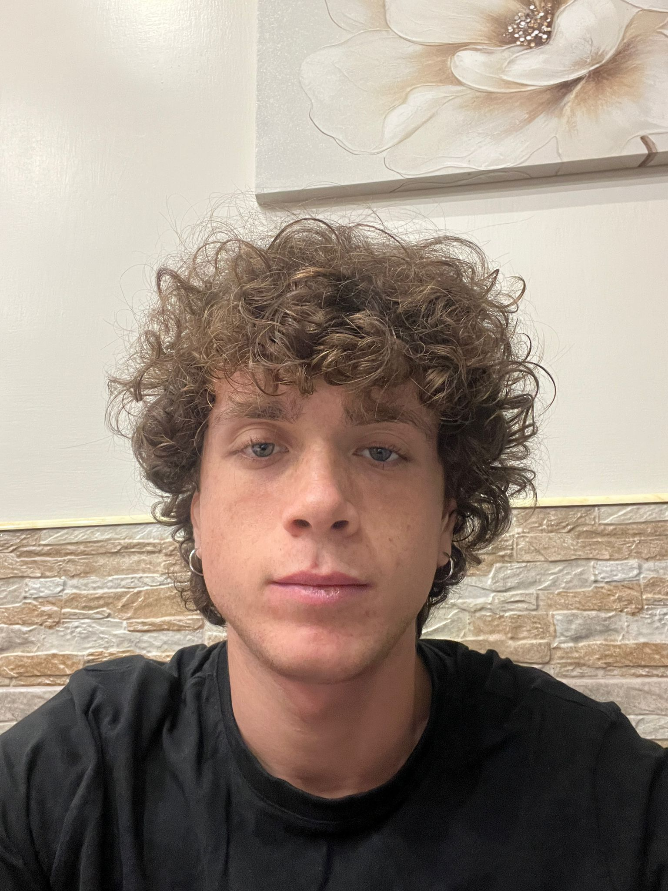

Mi chiamo Raffaele,ho 19 anni ed  ho iniziato il mio percorso nell’ambito artistico e tecnologico fin da giovanissimo. Da quando avevo 13 anni guido droni, una passione che è cresciuta insieme al mio interesse per la videografia e la fotografia, passioni che sento parte di me fin da quando ne ho memoria.

Ho conseguito il diploma da geometra con una valutazione di 93. In realtà, inizialmente avevo puntato al corso 'cinema ed audioviso', ma non sono stato ammesso al colloquio orale con testuali parole 'con i droni non si fanno i film' quindi ho deciso di cercare una strada alternativa. E oggi mi ritrovo qui, al primo anno dell'Accademia di Belle Arti ad NTA, ancora un po’ incerto sul motivo per cui ho scelto questo corso, ma certo della mia voglia di esplorare nuove possibilità creative, si spera

Nel frattempo, lavoro con la RAI come operatore drone e creo contenuti creativi per i social degli altri nei quali, a volte, esprimo la mia creatività e condivido i miei progetti. Il mio obiettivo attuale è costruire un drone FPV da 5 pollici,perchè un giorno lavorerò solo con i droni, avrò una casa invasa da loro. Quest'ultimo è un progetto che mi entusiasma molto e che rappresenta un mix tra il mio lato tecnico e quello creativo, perciò prof potrebbe finanziarmi

